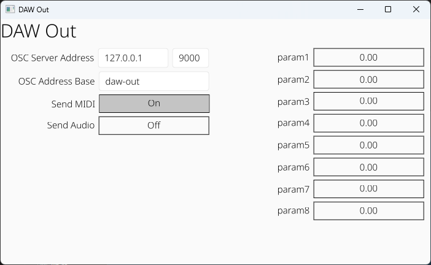

# OSCLAPHOTON  

CLAP Plugin for OSC output from a DAW to TD-Photon  

Adapted from [here](https://github.com/gamingrobot/daw-out) for my own purposes.  

<!--  -->

## Releases

<!-- Download the latest release [here](https://github.com/gamingrobot/daw-out/releases) -->

## OSC Messages

`osc_address_base` maps to the `OSC Address Base` specified in the plugin GUI

### Parameters

param1-param8 that can be modified by automation

`/<osc_address_base>/param/<param_name> <param_value>`


## Building

```sh
cargo xtask bundle OSCLAPHOTON --release
```
